<div align="center">



<br/><br/>

<a href="https://www.linkedin.com/in/maheshbabukona">
  
</a>
<a href="mailto:maheshbabukona2@gmail.com">
  
</a>
<a href="https://x.com/Maheshbabu_kona">
  
</a>
<a href="https://medium.com/@hiddenlayerNx">
  
</a>

</div>

<br/>

## About Me

I don't sit in the middle of the distribution. I build **local-first, citation-grounded AI tools** — software that refuses to hallucinate when it can point to a source instead — and I'll go to whatever depth a problem demands to get it shipped. Agentic systems, RAG, guardrails, and multi-agent routing are where I live; grit is how I get there.

```yaml
alias:       Anomaly
focus:       Agentic Systems · RAG · LLM Guardrails · Multi-Agent Routing
currently:   Building an AI-advised personal finance platform + Exocortex
education:   B.Tech CS (AI), Madanapalle Institute of Technology & Science — 8.56 GPA
published:   IEEE SCOPES 2024 — Adaptive Learning Platform (RAG-based)
```

<br/>

## What I'm Building

<table>
<tr>
<td width="50%" valign="top">

### 🧠 [Exocortex](https://github.com/Maheshbabukona/Exocortex)
Local-first cognitive engine that separates long-term knowledge, working memory, and reasoning into distinct layers. Responses are blocked unless the model can point to a verifiable coordinate in a source PDF — zero generation drift by design.

`LangChain` `Vector Retrieval` `Citation Grounding`

</td>
<td width="50%" valign="top">

### 🎓 [Enterprise Academy](https://github.com/Maheshbabukona/Enterprise-Academy)
Open-source, self-hostable AI learning platform. Upload documents, an agentic pipeline drafts a curriculum, and every lesson ships grounded and cited back to source — quizzes included.

`Agentic Pipelines` `RAG` `Self-Hosted`

</td>
</tr>
<tr>
<td width="50%" valign="top">

### 💰 [Valence](https://github.com/Maheshbabukona/Valence)
A personal finance app that respects your privacy — expense tracking and credit card management, no data leaving your device.

`React Native` `TypeScript` `Expo`

</td>
<td width="50%" valign="top">

### ⚔️ [THE SYSTEM](https://github.com/Maheshbabukona/LevelUp)
Solo-Leveling-themed daily routine tracker. No build step, installable PWA, XP-based ranks from E to S, synced via Firebase.

`PWA` `Firebase` `Vanilla JS`

</td>
</tr>
<tr>
<td width="50%" valign="top">

### 🐺 [WereWolf7](https://github.com/Maheshbabukona/WereWolf7)
An agentic social-deduction game — LLM agents play Werewolf against each other, bluffing and reasoning in the open.

`Multi-Agent` `LLM-vs-LLM`

</td>
<td width="50%" valign="top"></td>
</tr>
</table>

<br/>

## Tech Stack

<div align="center">

**Languages**
<br/>


**GenAI & Agents**
<br/>


**ML & Data**
<br/>


**Backend & Infra**
<br/>


</div>

<br/>

## Certifications

<div align="center">


-76B900?style=flat-square&logo=nvidia&logoColor=white)


</div>

<br/>

## GitHub Stats

<div align="center">


</div>

<br/>

<div align="center">



</div>
